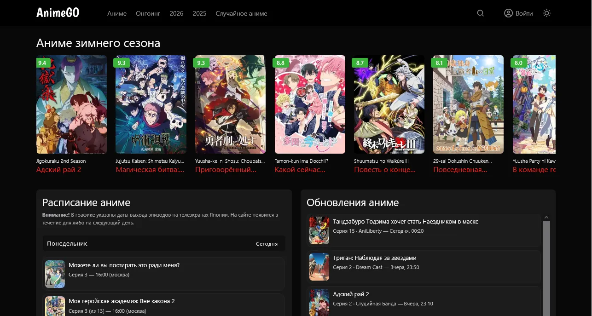
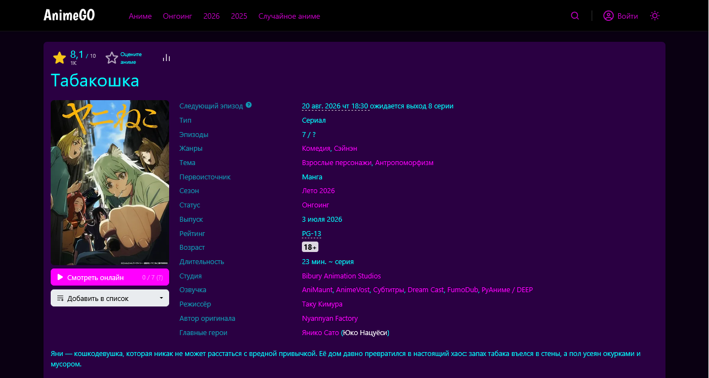
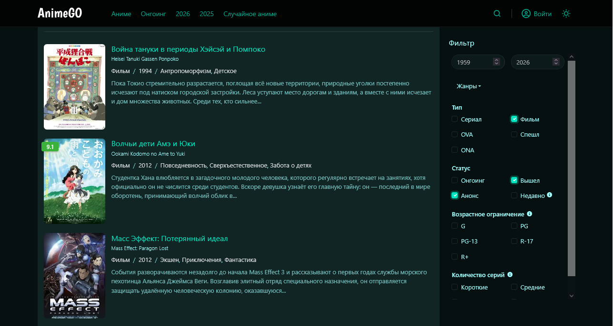
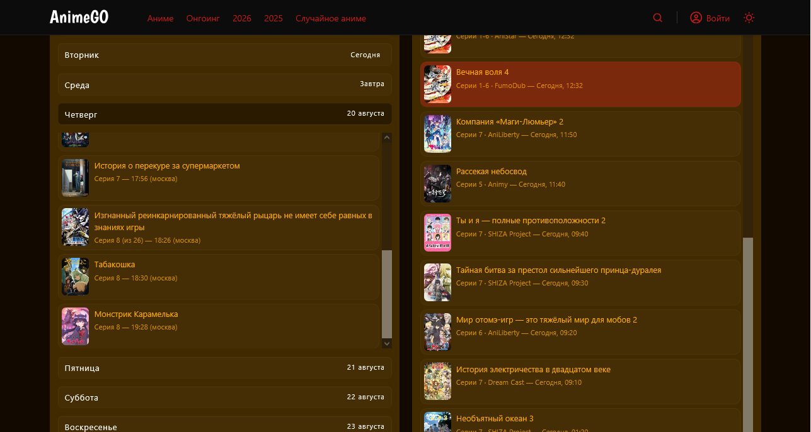

# AnimeGo-Dark-Theme

Небольшой стиль меняющий тёмную тему. С 2026 года, по случаю обновления интерфейса, код полностью зависит от системной тёмной темы. Но от этого он не становится бесполезнее, ведь в комлект входят дополнительные тёмные темы с другими цветами.

